# CartCopilot — Hybrid Food & Grocery AI Assistant (Microservices + LangGraph)

⭐ If you like this project, consider starring the repository!


## Key Features

• Conversational shopping assistant powered by LangGraph  
• Semantic product retrieval using FAISS vector search  
• Redis-based cart and session state management  
• Deterministic checkout workflow  
• Prometheus metrics instrumentation  
• Grafana observability dashboards  
• Dockerized microservices architecture

## Why This Project Exists

Modern AI assistants must integrate with real backend systems such as databases, carts, and checkout pipelines. 
CartCopilot demonstrates how conversational AI can be combined with production backend infrastructure to build 
real-world commerce assistants.

The project intentionally separates AI orchestration from business logic using microservices and deterministic state machines.

# Demo

## Streamlit Shopping Assistant

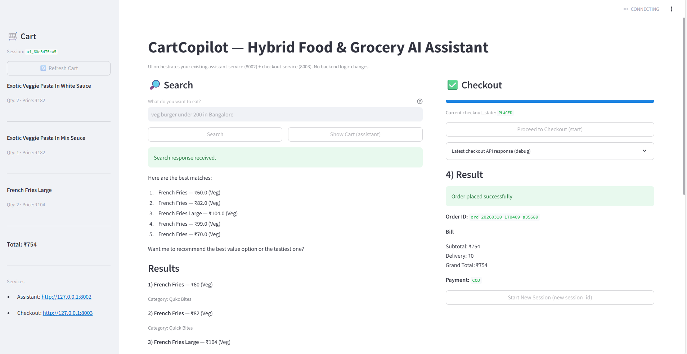
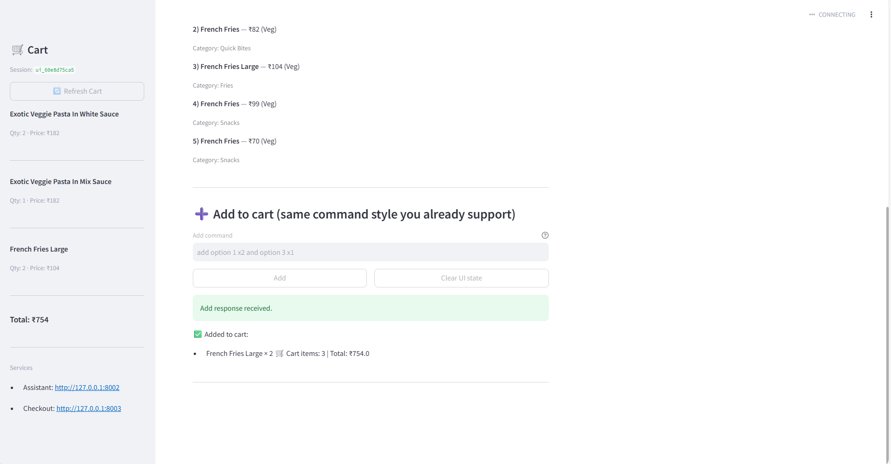

## Grafana Observability Dashboard

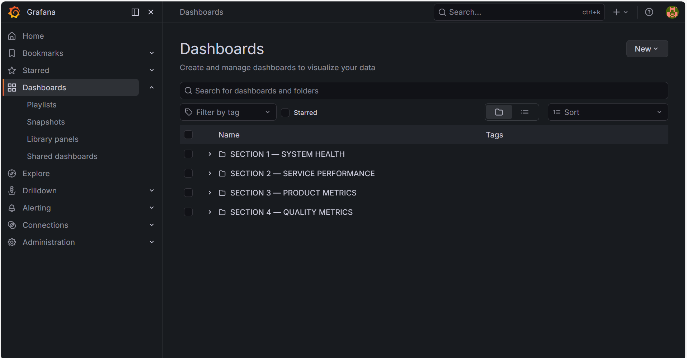
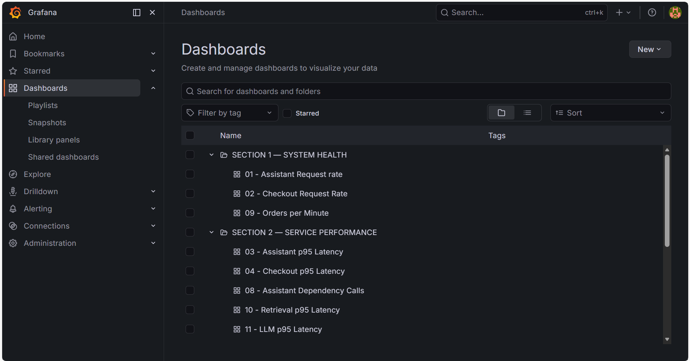
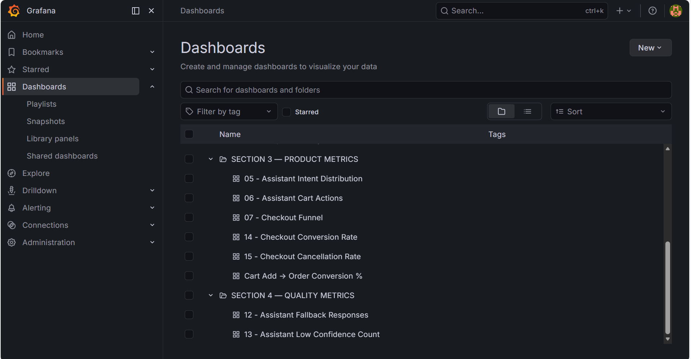

## Prometheus Observability Dashboard

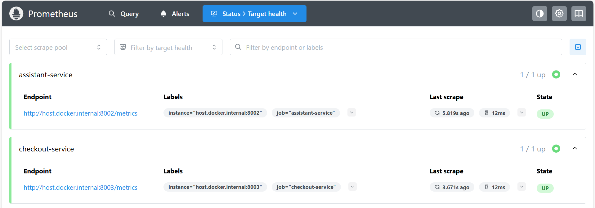
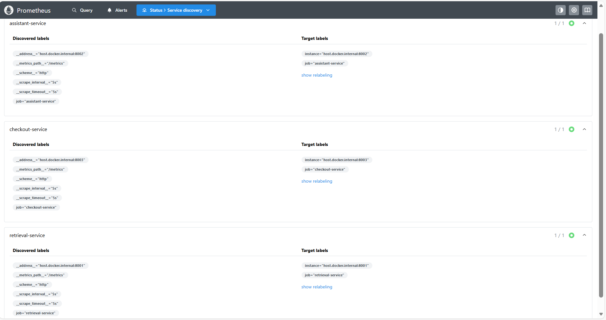

## System Architecture

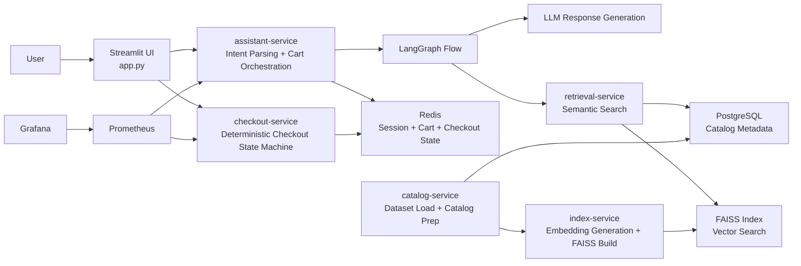

CartCopilot is a **microservices-based AI shopping assistant** that allows users to search grocery products conversationally, manage a cart via chat, and complete checkout through a deterministic checkout workflow.

The project demonstrates **modern AI backend engineering practices** including:

- LLM-assisted conversational orchestration
- Vector search retrieval (FAISS)
- Redis session and cart state management
- Deterministic checkout state machine
- Prometheus metrics instrumentation
- Grafana dashboards for observability
- Docker-based infrastructure

The system simulates a **production-style AI commerce platform**.

---

# 📌 Project Overview

CartCopilot demonstrates how a **conversational AI assistant can be combined with microservices architecture and deterministic business logic**.

Key capabilities:

- Conversational product search
- Semantic product retrieval
- Redis cart state
- Deterministic checkout state machine
- Production observability

The project shows how **AI systems integrate with real backend infrastructure**.

---

# 🏗 System Architecture

CartCopilot follows a **layered architecture used by AI platform teams**, separating UI, orchestration, data storage, commerce logic, and observability.

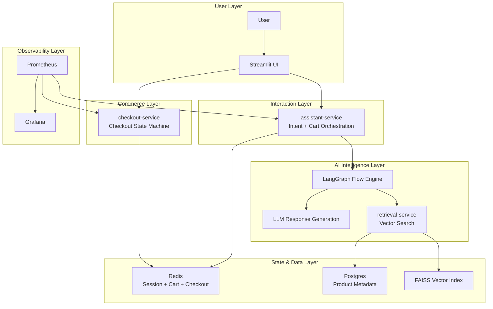

This layered architecture separates:

| Layer | Responsibility |
|------|------|
| UI | User interaction |
| Assistant | Conversation orchestration |
| Retrieval | Semantic search |
| Data | Redis / Postgres |
| Commerce | Checkout workflow |
| Observability | Metrics + monitoring |

---

# ⚙️ End-to-End System Flow

1. User interacts with **Streamlit UI**
2. Message is sent to **assistant-service**
3. Assistant decides whether to:
   - perform semantic retrieval
   - update the cart
4. Retrieval-service performs **FAISS similarity search**
5. Product metadata is retrieved from **PostgreSQL**
6. Selected items are stored in **Redis cart state**
7. Checkout-service runs **deterministic checkout workflow**
8. Metrics are emitted to **Prometheus**
9. **Grafana dashboards visualize system behaviour**

---

# 🧱 Technology Stack

| Layer | Technology |
|------|------------|
| UI | Streamlit |
| AI Orchestration | LangGraph |
| Vector Search | FAISS |
| Embeddings | SentenceTransformers |
| Database | PostgreSQL |
| State Store | Redis |
| Observability | Prometheus + Grafana |
| Infrastructure | Docker Compose |
| Language | Python |

---

## System Design Architecture

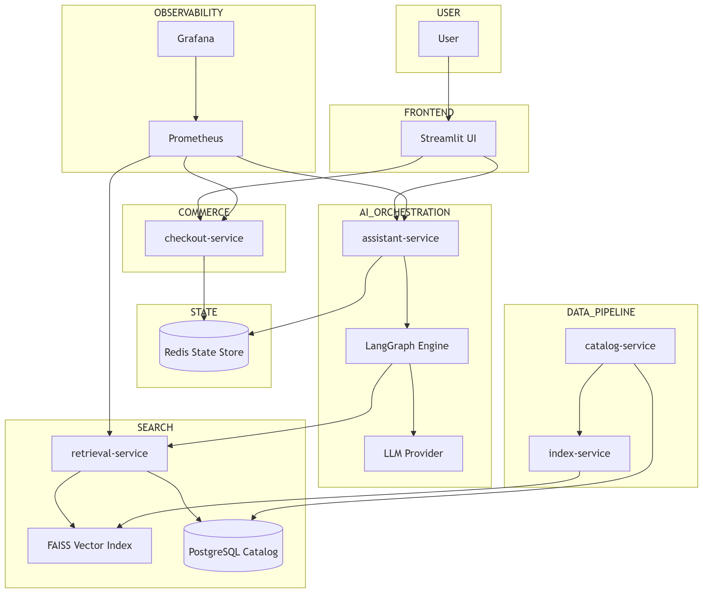

## Service Dependencies

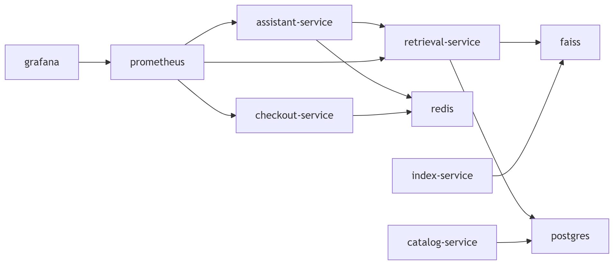

## Request Flow

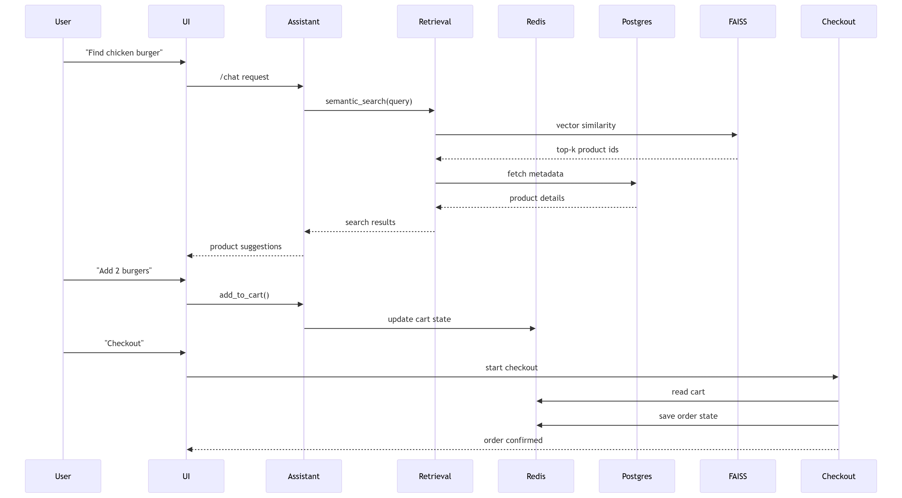

## AI Agent Decision Flow

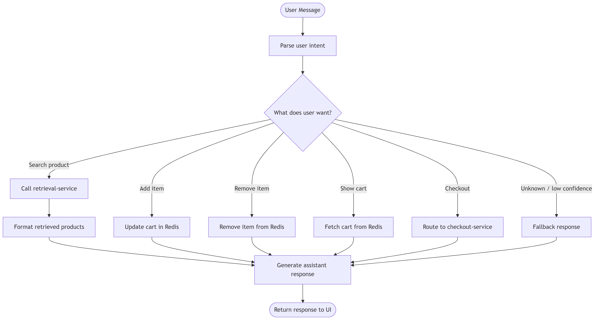

# 🧩 Microservices

## assistant-service

Responsible for **conversation orchestration**.

Features:

- Intent classification
- Retrieval orchestration
- Cart management
- LLM response generation
- Conversation state tracking

Dependencies:

- retrieval-service
- Redis
- LLM provider

Runs on:

```
http://localhost:8002
```

---

## retrieval-service

Responsible for **semantic product search**.

Flow:

```
User Query
  ↓
Embedding Generation
  ↓
FAISS similarity search
  ↓
Product metadata lookup
```

Uses:

- FAISS vector index
- PostgreSQL metadata

Runs on:

```
http://localhost:8001
```

---

## checkout-service

Handles the **checkout lifecycle using a deterministic state machine**.

Checkout states:

```
CART_READY
→ CHECKOUT_STARTED
→ ADDRESS_CAPTURED
→ PAYMENT_CAPTURED
→ ORDER_CONFIRMED
```

Features:

- idempotent checkout start
- Redis state persistence
- order confirmation
- cancellation tracking

Runs on:

```
http://localhost:8003
```

---

## index-service

Builds FAISS indexes from product catalog.

Responsibilities:

- load dataset
- generate embeddings
- build vector index
- store metadata mappings

Generated artifacts:

```
indexes/faiss_*.index
indexes/mapping_*.json
indexes/metadata_*.json
```

---

## catalog-service

Handles dataset ingestion.

Responsibilities:

- create product schema
- load dataset
- populate PostgreSQL tables

---

# 📊 Observability

CartCopilot includes a **production-style observability stack**.

Components:

- Prometheus
- Grafana

Observability pipeline:

```
User interaction
↓
Services emit metrics
↓
Prometheus scrapes /metrics endpoints
↓
Metrics stored as time series
↓
Grafana queries Prometheus
↓
Dashboards visualize system behaviour
```

---

# 📈 Grafana Dashboard Layout

The dashboard follows **SRE Golden Signals layout**.

Sections include:

- System Health
- Service Performance
- Product Metrics
- Quality Metrics

---

# 📊 Example PromQL Queries

### Assistant Request Rate

```promql
sum(rate(http_requests_total{service="assistant-service"}[1m]))
```

Purpose: monitor assistant traffic.

---

### Checkout Request Rate

```promql
sum(rate(http_requests_total{service="checkout-service"}[1m]))
```

Purpose: monitor checkout load.

---

### Orders Per Minute

```promql
rate(orders_placed_total[1m]) * 60
```

Purpose: order throughput.

---

### Assistant p95 Latency

```promql
histogram_quantile(
0.95,
sum(rate(http_request_duration_seconds_bucket{service="assistant-service"}[5m]))
)
```

Purpose: detect slow assistant responses.

---

### Checkout p95 Latency

```promql
histogram_quantile(
0.95,
sum(rate(http_request_duration_seconds_bucket{service="checkout-service"}[5m]))
)
```

Purpose: detect slow checkout responses.

---

### Retrieval Latency

```promql
histogram_quantile(
0.95,
sum(rate(assistant_retrieval_latency_seconds_bucket[5m])) by (le)
)
```

Purpose: monitor vector search performance.

---

### LLM Latency

```promql
histogram_quantile(
0.95,
sum(rate(assistant_llm_latency_seconds_bucket[5m])) by (le)
)
```

Purpose: monitor AI response time.

---

# 🧠 Product Metrics

### Assistant Intent Distribution

```promql
sum by (intent) (assistant_messages_total)
```

Purpose: understand user interaction patterns.

---

### Cart Actions

```promql
assistant_cart_add_total
assistant_cart_remove_total
assistant_show_cart_total
```

Purpose: track shopping behaviour.

---

### Checkout Funnel

```promql
checkout_started_total
checkout_address_saved_total
checkout_payment_saved_total
orders_placed_total
checkout_cancelled_total
```

Purpose: visualize checkout progression.

---

### Conversion Metrics

Cart → Order conversion:

```promql
orders_placed_total / assistant_cart_add_total
```

Checkout success rate:

```promql
orders_placed_total / checkout_start_attempts_total
```

Cancellation rate:

```promql
checkout_cancelled_total / checkout_start_attempts_total
```

---

# ⚠️ Prometheus Alerting

Alert rules detect abnormal behaviour.

Example alerts:

- assistant latency spike
- checkout latency spike
- fallback response spike
- low-confidence spike
- no orders placed
- service down detection

Example rule:

```promql
histogram_quantile(
0.95,
sum(rate(http_request_duration_seconds_bucket{service="assistant-service"}[5m]))
) > 0.5
```

---

# 🔐 Environment Variables

Create environment file from example:

```
cp .env.example .env
```

Example variables:

```
OPENAI_API_KEY=
POSTGRES_URL=
REDIS_URL=
```

---

# 🚀 Quickstart

## 1 Clone Repository

```
git clone https://github.com/<username>/CartCopilot.git
cd CartCopilot
```

---

## 2 Create Environment File

```
cp .env.example .env
```

---

## 3 Start Infrastructure

```
cd infra
docker compose up -d
```

Containers started:

```
cartcopilot-postgres
cartcopilot-redis
cartcopilot-prometheus
cartcopilot-grafana
```

---

## 4 Install Python Dependencies

```
pip install -r requirements.txt
```

---

## 5 Load Dataset

Place dataset here:

```
Dataset/Swiggy.csv
```

Run:

```
python services/catalog-service/load_swiggy.py
```

---

## 6 Build FAISS Index

```
python services/index-service/build_index.py
```

---

## 7 Start Services

Terminal 1:

```
cd services/retrieval-service
uvicorn src.main:app --port 8001
```

Terminal 2:

```
cd services/assistant-service
uvicorn src.main:app --port 8002
```

Terminal 3:

```
cd services/checkout-service
uvicorn src.main:app --port 8003
```

---

## 8 Start UI

```
cd ui
streamlit run app.py
```

Open:

```
http://localhost:8501
```

---

# 🧪 Example Demo Flow

User:

```
I want a chicken burger
```

Assistant returns:

```
1. Chicken Burger
2. Spicy Chicken Burger
3. Chicken Wrap
```

User:

```
Add 2 chicken burgers
```

Redis updates cart.

User:

```
Checkout
```

Checkout-service finalizes order.

---

# 📂 Repository Structure

```
CartCopilot
│
├── services
│   ├── assistant-service
│   ├── retrieval-service
│   ├── index-service
│   ├── checkout-service
│   └── catalog-service
│
├── ui
│   └── app.py
│
├── infra
│   ├── docker-compose.yml
│   ├── grafana
│   └── prometheus
│
├── Dataset
├── indexes
├── docs
│
├── .env.example
├── .gitignore
├── README.md
```

---

# 🧠 Skills Demonstrated

This project demonstrates:

- Microservices architecture
- AI assistant orchestration
- Vector search systems
- Retrieval pipelines
- Redis session management
- PostgreSQL data pipelines
- Prometheus instrumentation
- Grafana dashboards
- Docker infrastructure
- Production observability

---

# 🌍 Real-World Applications

CartCopilot architecture can power:

- conversational commerce
- AI ordering assistants
- retail automation
- AI agent platforms
- intelligent shopping assistants

---

## Development Utilities

This repository includes helper files for development:

- **Makefile** — run services using simple commands  
- **LICENSE** — MIT open source license  
- **CONTRIBUTING.md** — guidelines for contributing

# 👤 Author

Milind Soam

---

# License

MIT License